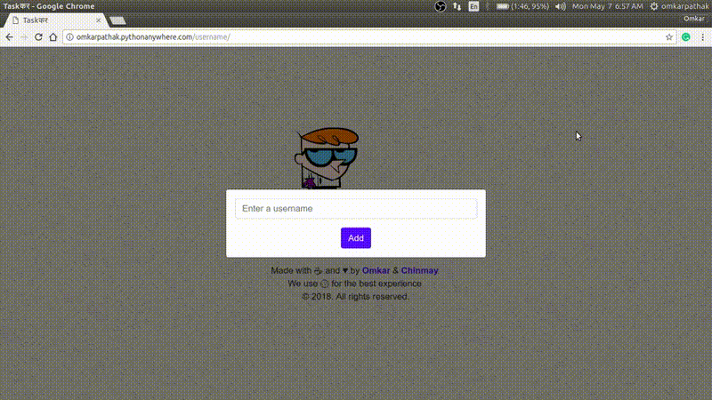

# Django-to-do
A dead simple Django ToDo Web App

This is a sample project that a novice django developer can use to get started.

## Working



## Features

- Dead simple
- Easily add, delete
- Simple UI
- Blazing fast

## Run the app

- Make sure you have installed Docker daemon

- Download the files from this repo

    ```bash
	$ git clone https://github.com/Antek74/Django-to-do-docker
    ```

- Change the directory to the folder where you downloaded files

    ```bash
	$ cd Django-to-do-docker
    ```

- Copy sqlite db to be externally hosted as volume (so it survives container restarts)

    ```bash
	$ cp ~/db-zadatak1.sqlite3 .
    ```

- Build a Docker image

    ```bash
	$ sudo docker build -t django-to-do-docker .
    ```

- Run the image

    ```bash
	$ sudo docker run -d \
	-it \
	--name django-to-do-docker \
	--mount type=bind,source="$(pwd)"/db-zadatak1.sqlite3,target=/code/todo/db.sqlite3 \
	-p 8000:8000 \
	-t django-to-do-docker:latest
    ```

- After successful installation execute the following commands to check if container is running well:

    ```bash
	$ sudo docker ps
	>CONTAINER ID   IMAGE                        COMMAND                  CREATED         STATUS         PORTS                    NAMES
	>9a93c40b7de7   django-to-do-docker:latest   "python /code/todo/m…"   8 minutes ago   Up 8 minutes   0.0.0.0:8000->8000/tcp   django-to-do-docker
    ```


- Visit `$IP:8000` in your browser where $IP is IP address of the Docker host.

## Dockerfile explanation

FROM python:3.7 # app is built with Django 2.0.8, so max version of python is 3.7
ENV PYTHONUNBUFFERED 1 # force python to flush data to stdout instantly, prevents buffering
RUN mkdir /code # mkdir the root dir
WORKDIR /code # define working dir
COPY requirements.txt /code/ # copy requirements to working dir
RUN pip --no-cache-dir install -r requirements.txt # install python deps once
ADD . /code/ # add all code to working dir
CMD [ "python", "/code/todo/manage.py", "runserver", "0.0.0.0:8000" ] # run server once container starts

## Docker build syntax explanation

-t defines name of the image, "." defines working dir where to search for Dockerfile

## Docker run syntax explanation

"-it"
"--mount" - instruct container to bind external file (sqlite db) so it can persists across container restarts
"-p" instructions for iptables so it can route the traffic from host to container
    
    ```bash
	sudo iptables -t nat -L DOCKER -n
	>Chain DOCKER (2 references)
	>target     prot opt source               destination         
	>RETURN     all  --  0.0.0.0/0            0.0.0.0/0           
	>DNAT       tcp  --  0.0.0.0/0            0.0.0.0/0            tcp dpt:8000 to:172.17.0.2:8000
    ```

## Start from scratch if something goes wrong :)

    ```bash
	$ sudo docker stop $(sudo docker ps -q)
	$ yes | sudo docker system prune -a
    ```

Built with ♥ by [`Omkar Pathak`](http://www.omkarpathak.in/), dockerised by Ante K.
